# SpringCloud

## 概述
### SpringCloud是什么？

## Eureka注册中心
### Eureka是什么？
&nbsp;&nbsp;&nbsp;&nbsp;Eureka是Netflix公司开源的一款服务注册与发现的产品，基于restful实现，是springcloud体系中重要的组件之一。Eureka包括了EurekaServer和EurekaCLient两部分组成。目前Eureka提供了1.x的版本和2.x的版本，在2018年7月Netflix已经宣布停止维护2.x的版本。
- 入门示例
### Eureka实现原理
- 原理图

  

- **服务注册**
  - Service Provider(EurekaClient)启动时，会将自身服务注册到Eureka Server的注册表中，服务信息包括：服务名称，实例标识，服务状态信息等。
- **服务续约**
  - Service Provider(EurekaClient)默认每30秒向EurekaServer发送健康检查，更新EurekaServer注册表中的续约时间，证明服务的可用性。
- **服务下线**
  - Service Provider(EurekaClient)准备停止服务时，向EurekaServer发送服务下线请求(cancle)，将服务从注册表去除。
- **服务拉取**
  - Service Consumer(EurekaClient)默认每30秒从EurekaServer获取全量或者增量服务注册表信息，并缓存到本地。
- **服务调用**
  - Service Consumer(EurekaClient)通过本地注册表信息查找到服务地址，采用restful方式调用Service Provider(EurekaClient)提供的服务。
- **服务剔除**
  - **引入原因**：ServiceProvider可能存在非正常退出，会导致EurekaServer中存在大量的不可用的服务。
  - 默认当服务续约时间超过90秒后，EurekaServer会将该服务从可用服务注册表中剔除，保证服务的实时性。
  - **问题**：由于网络等原因，可能剔除大量的可用的服务，导致EurekaServer的可用性降低。
- **自我保护机制**
  - **引入原因**：服务剔除机制中，可能由于EurekaServer与EurekaClient之间的网络原因，导致服务大范围被误删，影响服务的可用性，生产环境建议打开保护机制。
  - **触发机制**：如果在15分钟之内超过85%的客户端没有正常续约，则认为EurekaClient和EurekaServer出现了网络故障，EurekaServer会自动进入自我保护状态。此时EurekaServer会有如下行为：
    - EurekaServer不再从服务注册表中剔除服务，哪怕超过了90秒未续约。
    - EurekaServer仍然会接受服务注册和服务拉取请求，但是新注册的服务不会同步到其他的节点上。
  - **恢复机制**：当网络恢复，续约正常，自我保护机制自动关闭，注册信息会同步到其他EurekaServer节点。
  - **问题**：自我保护机制阶段，正好有服务正常剔除，但是由于保护机制被保留的信息，会导致EurekaClient调用一个失效的服务。
    - **解决方式**：EurekaClient端容错机制，进行重试与断路器机制，保证调用到失效的服务也不会出现服务超时，雪崩等问题。

### Eureka高可用实现原理
- 原理图

- P2P同步机制
  - Eureka Server的集群节点之间是平等的，不区分角色，节点之间通过互相注册保证服务的可用性；每个节点都会添加一个或者多个有效的serviceUrl，当一个节点宕机，客户端会自动的切换到其他的节点。
  - Eureka Server的集群节点之间通过异步的方式进行同步，所以在节点之间数据不一致的情况，但基本保证数据最终一致性。
  - Eureka Server的集群节点满足CAP原则中的AP原则，只要有一个节点存活就能保证服务可用，但是客户端获取的服务列表可能不是最新的，未保证强一致性。

- 服务优先级
  - EurekaClient优先从同一个Zone的EurekaServer进行注册服务或拉取服务注册表。e的EurekaServer。
  - 当EurekaClient无法从同一个Zone的EurekaServer注册或拉取服务时，会自动切换到其他节点。
### Eureka配置优化
  -
### Eureka VS Zookeeper

## Zuul网关

## OpenFeign

## Hystrix

## Ribbon

## Sleuth

>Reference:
>https://cloud.spring.io/spring-cloud-static/Hoxton.SR3/reference/html/spring-cloud-hoxton-configprops.html
>https://spring.io/projects/spring-cloud
>
