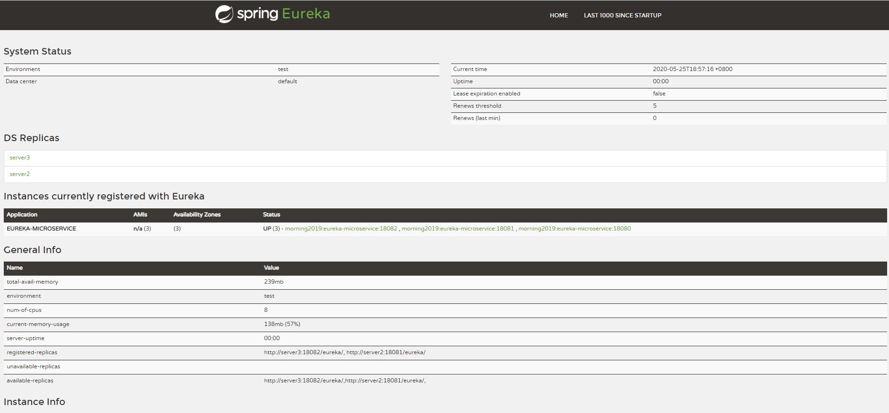

>Reference:
>https://spring.io/projects/spring-cloud-netflix#overview
>https://start.spring.io/
>https://segmentfault.com/a/1190000008378268
>https://blog.csdn.net/qq_25112523/article/details/83028529
>https://www.cnblogs.com/eastday/p/10449683.html
- 技术点：
  - springboot 2.2.6
  - springcloud Hoxton.SR3
  - eureka
- 目标
  - 搭建eureka高可用环境(3台eureka)
- 测试用例
  - 启动3台服务，观察每台服务的注册信息，均为正常注册
  - 关闭eureka1,eureka2与eureka3能继续提供服务
  - 开发测试环境下，关闭3台服务自保护机制
  
### eureka高可用搭建
- eureka1
- eureka2
- eureka3
#### 配置文件

#### 验证
访问：http://localhost:18080/

### FAQ
- 自保护机制默认开启，导致服务无法注册
- 集群中服务名称不一致，导致互相注册
- 出现unavailable-replicas的服务
- 修改hosts文件

