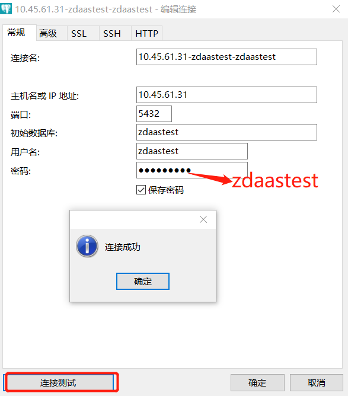

# 快速安装postgresql10

## 准备
- CentOS7.4主机一台(4C8G60G)
- 外网环境
- 具有sudo权限的用户
## 安装
- 检查是否已经安装postgresql
  ```
  [zdaas@hp15 ~]$ rpm -qa | grep postgre
  postgresql-libs-9.2.21-1.el7.x86_64
  ```
  - 卸载已经安装的postgresql
  ```
  [zdaas@hp15 ~]$ sudo yum remove postgresql*
  已加载插件：fastestmirror
  正在解决依赖关系
  --> 正在检查事务
  ...........
  作为依赖被删除:
    sysbench.x86_64 0:1.0.9-2.el7                                                            
  完毕！
  ```
- Install the repository RPM
  ```
  [zdaas@hp15 ~]$ sudo yum install https://download.postgresql.org/pub/repos/yum/reporpms/EL-7-x86_64/pgdg-redhat-repo-latest.noarch.rpm
  已加载插件：fastestmirror
  pgdg-redhat-repo-latest.noarch.rpm  | 6.5 kB  00:00:00     
  正在检查 /var/tmp/yum-root-6UKnbO/pgdg-redhat-repo-latest.noarch.rpm: pgdg-redhat-repo-42.0-11.noarch
  .........
  已安装:
    pgdg-redhat-repo.noarch 0:42.0-11                        
  完毕！
  ```
- Install PostgreSQL
  ```
  [zdaas@hp15 ~]$ sudo yum install postgresql10-server
  已加载插件：fastestmirror
  pgdg-common                                | 2.9 kB  00:00:00     
  pgdg10                                     | 3.6 kB  00:00:00     
  pgdg11                                     | 3.6 kB  00:00:00     
  pgdg12                                     | 3.6 kB  00:00:00     
  pgdg95                                     | 3.6 kB  00:00:00
  ........
  完毕！   
  ```
- initialize the database
  ```
  [root@hp15 home]#  sudo -i /usr/pgsql-10/bin/postgresql-10-setup initdb
  Initializing database ... OK
  ```
- 设置开机启动(非必要)
  ```
  [zdaas@hp15 ~]$ sudo systemctl enable postgresql-10
  [zdaas@hp15 ~]$ sudo systemctl start postgresql-10
  ```
- 验证启动成功
  ```
  [zdaas@hp15 ~]$ sudo lsof -i:5432
  COMMAND     PID     USER   FD   TYPE   DEVICE SIZE/OFF NODE NAME
  postmaste 23101 postgres    3u  IPv6 48965852      0t0  TCP localhost:postgres (LISTEN)
  ```
## 配置远程连接
- 切换到postgres用户
  ```
  [zdaas@hp15 ~]$ sudo -i
  [root@hp15 ~]# su - postgres
  上一次登录：二 8月  4 18:47:35 CST 2020pts/1 上
  -bash: PROMPT_COMMAND: 只读变量
  -bash-4.2$ vi  /var/lib/pgsql/10/data/postgresql.conf
  ```
- 修改文件postgresql.conf
  ```
  vi  /var/lib/pgsql/10/data/postgresql.conf
  把listen_address = 'localhost' 改为 listen_address = '*'
  ```
- 修改文件pg_hba.conf
  ```
  vi /var/lib/pgsql/10/data/pg_hba.conf
  在文件最后加入:
  host all all 0.0.0.0/0 md5
  ```
- 重启postgresql(切回普通用户)
  ```
  [zdaas@hp15 ~]$ sudo systemctl stop postgresql-10
  [zdaas@hp15 ~]$ sudo systemctl start postgresql-10
  ```
- 验证
  NAME是*:postgres(LISTEN)
  ```
  [zdaas@hp15 ~]$ sudo lsof -i:5432
  COMMAND   PID     USER   FD   TYPE   DEVICE SIZE/OFF NODE NAME
  postmaste 643 postgres    3u  IPv4 48964243      0t0  TCP *:postgres (LISTEN)
  postmaste 643 postgres    4u  IPv6 48964244      0t0  TCP *:postgres (LISTEN)
  ```
## 创建数据库
- 先切换到postgre用户(先切换到root再切换到postgres)
  ```
  [zdaas@hp15 ~]$ sudo -i
  [root@hp15 ~]# su - postgres
  上一次登录：二 8月  4 18:59:52 CST 2020pts/1 上
  -bash: PROMPT_COMMAND: 只读变量
  -bash-4.2$ /usr/pgsql-10/bin/createdb zdaastest
  ```
- 创建数据库
  ```
  /usr/pgsql-10/bin/createdb zdaastest
  ```
- psql登录
  ```
  postgres@dell31[/var/lib/pgsql]$   /usr/pgsql-10/bin/psql -d zdaastest
  psql (10.13)
  Type "help" for help.

  zdaastest=#
  ```
- 创建用户
  ```
  create user zdaastest password 'zdaastest';
  create schema zdaastest authorization zdaastest;
  alter user zdaastest createdb createrole;
  ```
- 修改用户密码
  ```
  alter user zdaastest with password 'zdaastest';
  ```
## 客户端登录
- 防火墙开放端口（或者关闭防火墙）
  ```
  sudo firewall-cmd --permanent --zone=public --add-port=5432/tcp
  sudo firewall-cmd --reload
  ```
  关闭防火墙
  ```
  sudo systemctl stop firewalld.service
  sudo systemctl status firewalld.service
  ```
- 客户端连接
  

## 配置优化
修改文件/var/lib/pgsql/10/data/postgresql.conf中如下参数：
```
show max_connections; -- 2000
show fsync; -- off
show shared_buffers; -- 1GB
show work_mem; -- 10MB
show effective_cache_size; -- 4GB
show maintenance_work_mem; -- 512MB
show checkpoint_completion_target; --0.9
show commit_delay; -- 0
SHOW commit_siblings; --5
```
## 常用操作
```
-- 删除表数据
TRUNCATE table ssperf0,ssperf1,ssperf2,ssperf3;

-- 查询数据库信息
select * from pg_database ; 
```

>reference:
https://www.postgresql.org/download/linux/redhat/
https://blog.csdn.net/Gzigithub/article/details/85169436
