# 数据分片内核学习

## 概述

#### 全局对象

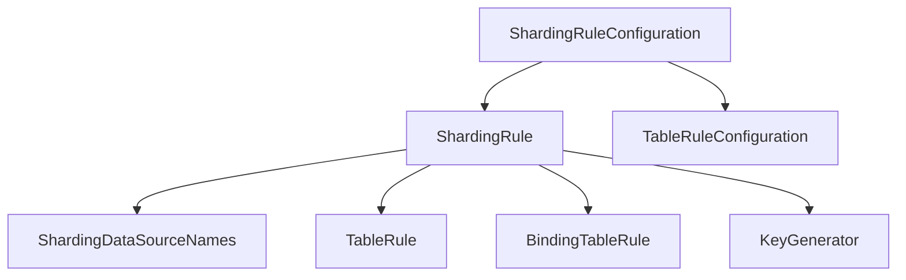

### SQL执行流程

```java
ShardingStatement.executeQuery(final String sql) -> 
ParsingSQLRouter.parse(sql) ->
StatementRoutingEngine.route(sql) -> SQLRewriteEngine.rewrite
StatementExecutor.init(final SQLRouteResult routeResult) ->
SQLExecutePrepareTemplate.getExecuteUnitGroups -> 
StatementExecutor.executeQuery() ->
SQLExecuteTemplate.executeGroup ->
ShardingExecuteEngine.groupExecute ->
MergeEngine.merge()
```

### 核心代码

```java
SQLParsingEngine->SQLParserFactory->SQLParser->parse()->SQLStatement
OptimizeEngineFactory->OptimizeEngine->optimize()->ShardingConditions
RoutingEngineFactory->RoutingEngine->route()->RoutingResult->TableUnits->Collection<TableUnit>->List<RoutingTable>
SQLRewriteEngine->rewrite()->SQLBuilder->generateSQL()->SQLUnit->SQLRouteResult
ShardingExecuteEngine->groupExecute()->List<ResultSet>
MergeEngineFactory->MergeEngine->merge()->MergedResult->ShardingResultSet
```


### Sharding数据分片的核心主流程如下：


## SQL解析

### 输入

```mermaid

```

### 输出

SQLStatement

```mermaid
graph LR
SQLStatement --> B(AbstractSQLStatement)
B --> C(DALStatement)
B --> D(TCLStatement)
C --> UseStatement
C --> ShowTablesStatement
C --> ShowTableStatusStatement
C --> ShowStatement
C --> ShowOtherStatement
C --> ShowIndexStatement

```


## 查询优化

### 输入

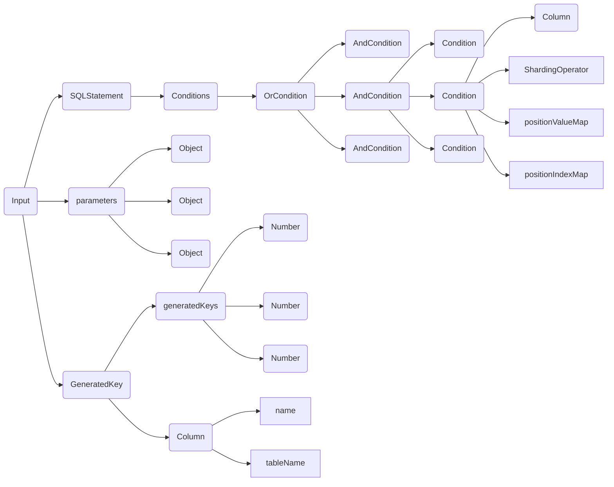

### 输出

分片条件列表

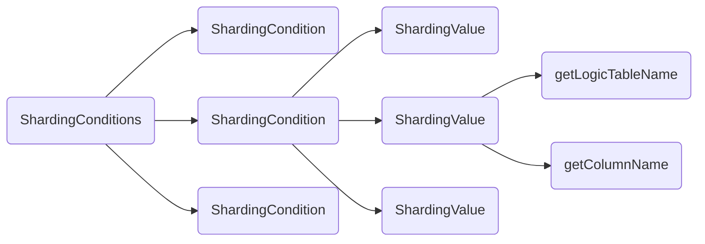

### 整体逻辑

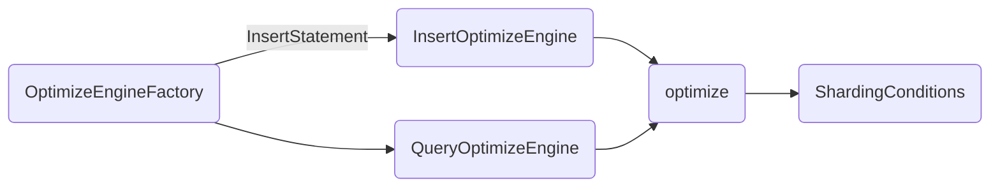

### Insert优化逻辑


### Query优化逻辑


## SQL路由

### 功能架构

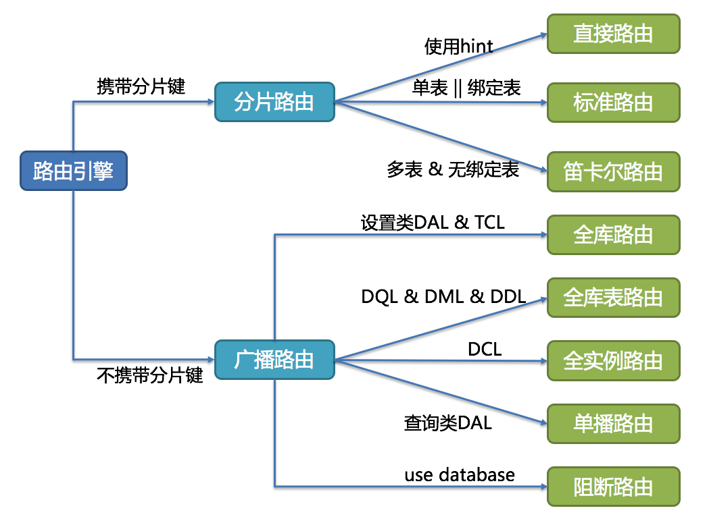


### SQL路由逻辑

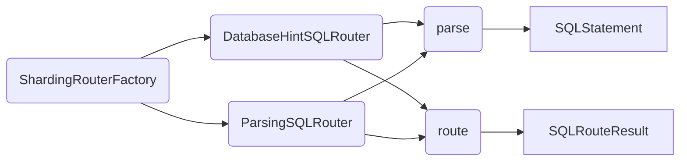

#### SQL路由输入

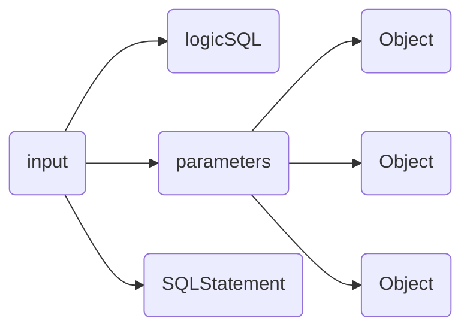


#### SQL路由输出

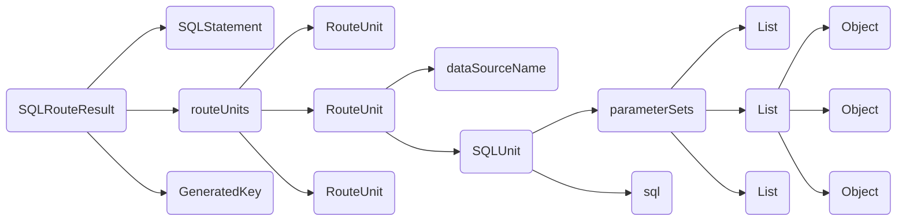


### table路由逻辑

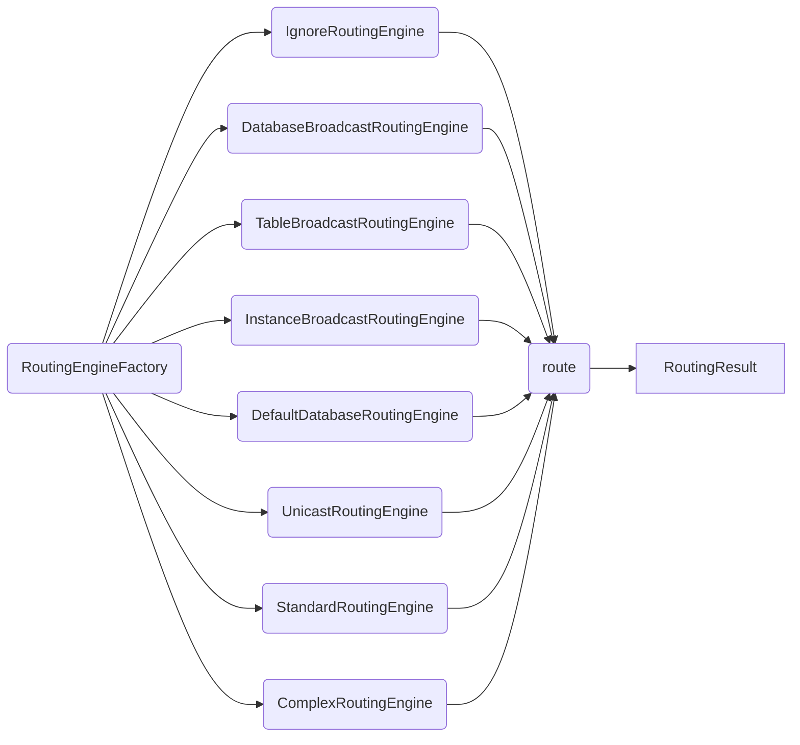

#### table路由输入

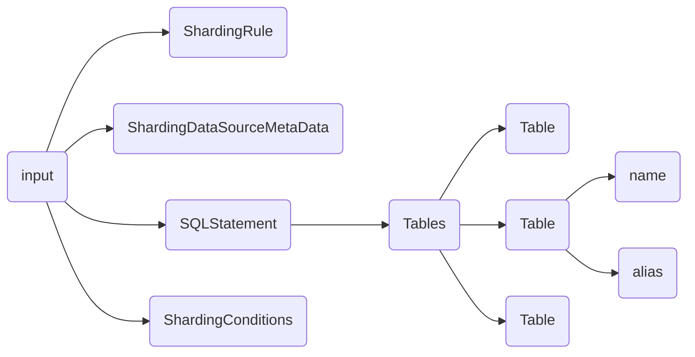

#### table路由输出

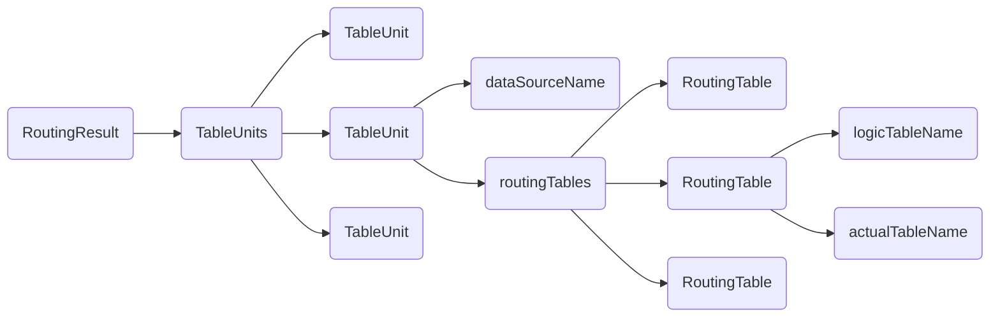


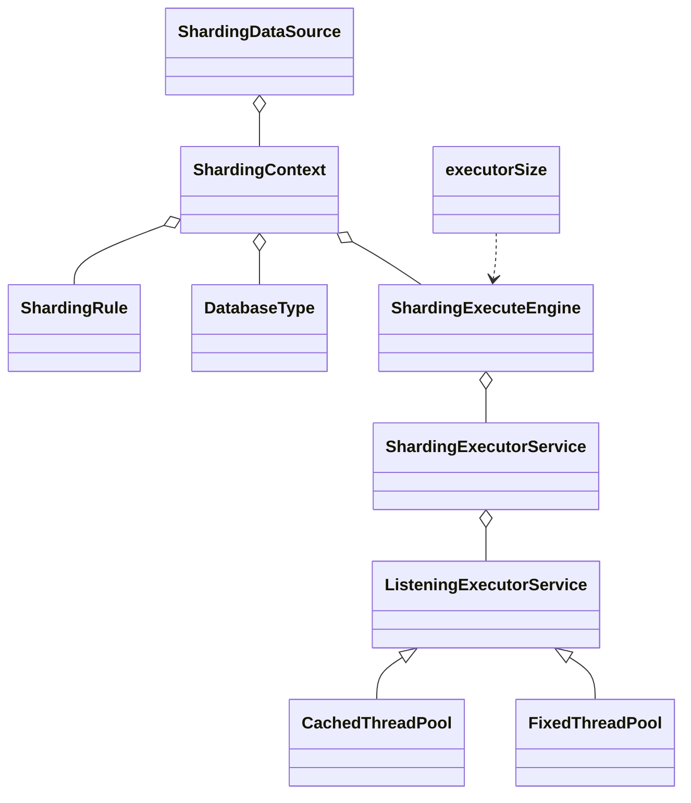


## SQL改写

### 功能架构


### 原理解读

### 源码解读

- 核心模型
- 核心类
- 核心流程

## 执行引擎

### 功能解读

### 原理解读

### 源码解读

- 核心类

  ```mermaid
  classDiagram
  ShardingDataSource o-- ShardingContext
  ShardingContext o-- ShardingRule
  ShardingContext o-- DatabaseType
  ShardingContext o-- ShardingExecuteEngine
  ShardingExecuteEngine o-- ShardingExecutorService
  ShardingExecutorService o-- ListeningExecutorService
  ListeningExecutorService <|--  CachedThreadPool
  ListeningExecutorService <|--  FixedThreadPool
  executorSize ..> ShardingExecuteEngine
  
  ShardingDataSource : -shardingContext
  ShardingContext: -executeEngine
  executorSize : -int
  ShardingExecuteEngine : -shardingExecutorService
  ShardingExecutorService : -executorService 
  ShardingExecutorService : -SHUTDOWN_EXECUTOR
  
  ```

  - ShardingExecuteEngine:执行引擎，本质上是采用线程池执行SQL
  - executorSize: 线程池大小，默认为0，不限制大小

- 核心流程

  - 