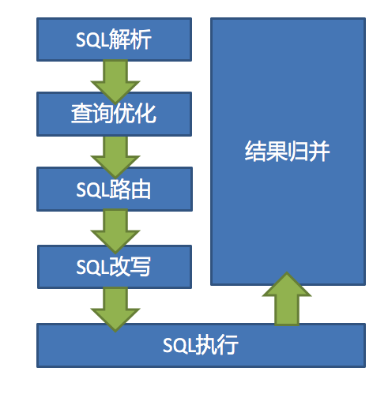

# 数据分片内核学习

## 概述

Sharding数据分片的核心主流程如下：




## SQL解析

## SQL路由

## SQL改写

### 功能解读

### 原理解读

### 源码解读

- 核心模型
- 核心类
- 核心流程

## 执行引擎

### 功能解读

### 原理解读

### 源码解读

- 核心类

  ```mermaid
  classDiagram
  ShardingDataSource o-- ShardingContext
  ShardingContext o-- ShardingRule
  ShardingContext o-- DatabaseType
  ShardingContext o-- ShardingExecuteEngine
  ShardingExecuteEngine o-- ShardingExecutorService
  ShardingExecutorService o-- ListeningExecutorService
  ListeningExecutorService <|--  CachedThreadPool
  ListeningExecutorService <|--  FixedThreadPool
  executorSize ..> ShardingExecuteEngine
  
  ShardingDataSource : -shardingContext
  ShardingContext: -executeEngine
  executorSize : -int
  ShardingExecuteEngine : -shardingExecutorService
  ShardingExecutorService : -executorService 
  ShardingExecutorService : -SHUTDOWN_EXECUTOR
  
  ```

  - ShardingExecuteEngine:执行引擎，本质上是采用线程池执行SQL
  - executorSize: 线程池大小，默认为0，不限制大小

- 核心流程

  - 